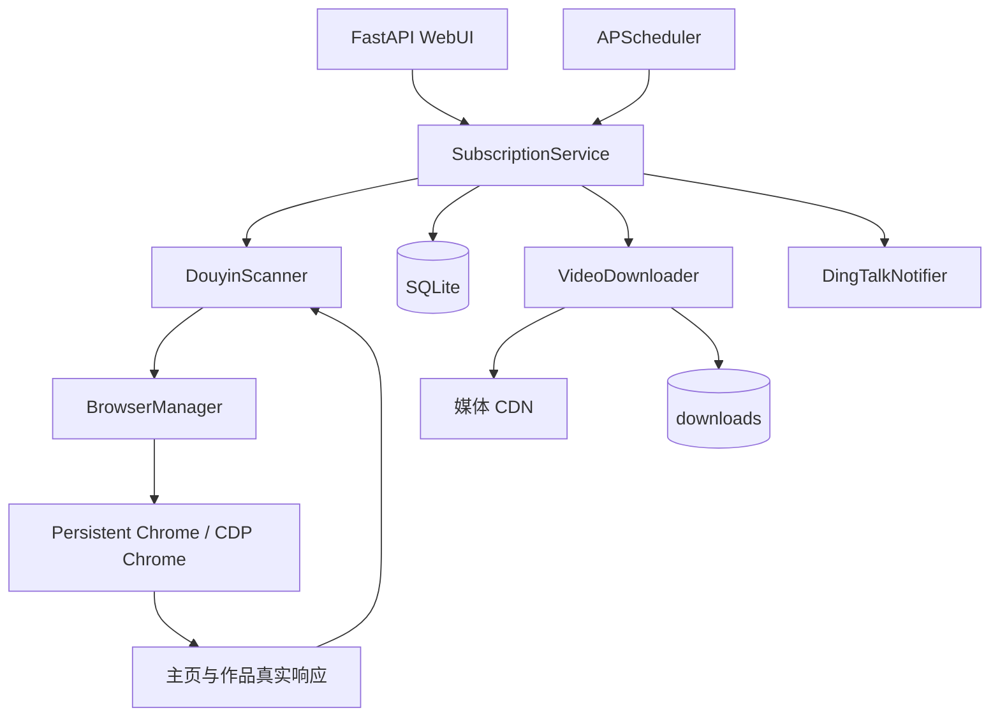

# 系统架构

## 1. 总体结构



## 2. 模块职责

| 文件 | 职责 |
| --- | --- |
| `main.py` | 唯一启动入口，准备 Linux 运行环境并启动 Uvicorn |
| `app/main.py` | FastAPI、生命周期、调度器和 HTTP API |
| `app/browser.py` | Playwright/CDP、Profile、页面保留与验证码检测 |
| `app/linux_runtime.py` | 无桌面 Linux 的 Xvfb、Chrome、x11vnc、noVNC 进程管理 |
| `app/douyin.py` | 主页扫描、网络响应解析、作者过滤、作品详情解析 |
| `app/service.py` | 任务调度、状态机、去重、下载队列、远端状态对账 |
| `app/downloader.py` | 视频/图片下载、候选源选择、断点续传和元数据 |
| `app/db.py` | SQLite 建表、轻量迁移、查询和状态更新 |
| `app/notifier.py` | 钉钉 Webhook 校验、HMAC-SHA256 加签和发送重试 |
| `app/static/` | 无构建步骤的原生 HTML/CSS/JavaScript 管理页 |

## 3. 浏览器模式

### 3.1 本机 persistent context

Windows 等有桌面环境默认执行：

```python
chromium.launch_persistent_context(user_data_dir=browser_data, channel="chrome")
```

系统 Chrome 不可用时回退到 Playwright Chromium。登录状态写入独立的 `browser_data`，不会使用用户日常 Chrome 的默认 Profile。

### 3.2 Linux 外部 CDP

没有 `DISPLAY` 时，`LinuxRuntime` 启动 Chrome 并开放仅本机 CDP，然后 `BrowserManager` 使用 `connect_over_cdp` 连接默认 context。Playwright 断开时不主动关闭由 `LinuxRuntime` 管理的 Chrome。

### 3.3 页面生命周期

页面分为：

- managed：当前扫描或解析任务正在使用；
- retained：登录、验证码或需要人工查看的页面；
- anchor：一个 `about:blank` 空白页，防止关闭最后一个标签页导致 Chrome 退出；
- disposable：推荐页、已完成扫描页、详情页和其他无用页面，任务后自动关闭。

不要删除锚点页逻辑。persistent context 的最后一个 target 被关闭后，Chrome 可能退出，而 Python context 暂时仍存在，下一次 `new_page()` 会报 `Target.createTarget`。

## 4. 扫描流程

1. 校验主页 URL，只接受抖音域名。
2. 创建临时任务页并注册 `response` 监听。
3. 打开主页，解析内嵌 JSON。
4. 捕获主页作品接口响应，提取 `aweme_id`、作者、媒体、图文和日常字段。
5. 识别目标主页的 `sec_uid`，过滤其他作者和推荐内容。
6. 滚动实际主页容器，持续等待分页响应。
7. 只有接口确认 `has_more=0`，并满足数量判断时才标记为完整扫描。
8. SQLite 按 `(creator_id, aweme_id)` upsert。
9. 完整扫描才执行删除/私密对账；不完整扫描只记录警告。
10. 下载 `pending` 和 `failed` 作品。

DOM 作品链接只是接口未返回时的最后兜底。已有权威主页响应后，不合并页面中的推荐卡片。

## 5. 下载流程

视频候选源按以下原则处理：

- 优先实际捕获的直连地址；
- 优先更高分辨率，再比较 FPS、码率和数据大小；
- 将 `/playwm/` 转成 `/play/`；
- 不使用常见 `download_addr` 水印下载源；
- 保留真实请求的部分 Header，并配合 Profile Cookie 和 User-Agent 重放。

图文/日常会提取无水印原图地址，写入独立目录。下载器使用 `.part` 和 `.part.url` 记录断点和来源 URL，支持 HTTP Range 续传。

## 6. 调度与并发

- APScheduler 每 `scan_poll_seconds` 秒检查到期用户。
- 每个创作者同一时间最多一个任务，由 `_tasks[creator_id]` 去重。
- 下次扫描时间加入 `schedule_jitter_ratio` 抖动，避免固定节奏。
- 下载并发默认 2，代码限制在 1 到 8。
- 单个图文内部图片并发上限为 `min(4, download_concurrency * 2)`。
- 关闭服务时取消剩余任务，并把中断的 `downloading` 记录在下次启动时恢复成 `pending`。

## 7. 与纯 HTTP 下载器的差异

类似 TikTokDownloader 的项目通常读取浏览器 Cookie，然后使用 `httpx` 加本地实现的 `a_bogus`、`msToken` 等参数直接请求接口。本项目选择让真实浏览器完成页面请求和动态参数生成，再捕获 JSON/媒体请求，减少签名实现随平台变化失效的维护成本。

代价是 Chrome 常驻资源更高。因此后续优化应优先考虑“浏览器维护合法会话、HTTP 下载媒体”的混合模式，而不是为每个监控用户启动独立浏览器。

## 8. 已知限制与后续方向

- `linux_novnc_mode` 和 `linux_novnc_idle_seconds` 尚未接入动态进程管理。
- WebUI 没有鉴权和用户隔离。
- 浏览器异常退出后的全自动 context 重建仍可进一步增强。
- 扫描依赖抖音 Web 响应结构，字段变化需要更新解析器和测试样本。
- 当前为单进程 SQLite 设计，不适合多个应用实例同时调度同一个数据库。

